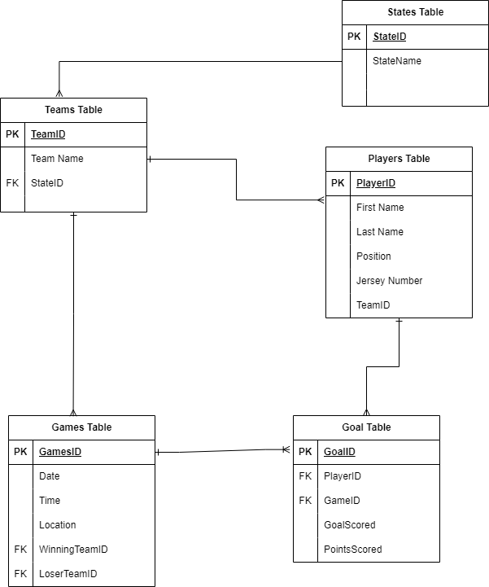

## R1	
### Identification of the problem you are trying to solve by building this particular app.

My idea for this app is to make it easily accesible to see the points a player gets from playing in an afl game. Previous methods used can be overwhelming by showing the other statitics a player can obtain during a match 

## R2	
### Why is it a problem that needs solving?
This problem needs solving as it will help users to define what goals and points a player has scored in a match. To help refine the search I have added the players team they play for and what time the match start and the date

## R3  
### Why have you chosen this database system. What are the drawbacks compared to others?

I've chosen postgres as its open source and free, with this there are multiple features that allows for advanced SQL queries.

Being free the community support is large and active, having multiple developers providing support by sharing knowledge through forums.

The drawbacks of using PostgreSQL including

PostgreSQL is much more complex that other commonly used database systems to set up and manage. 

Finally the performance isnt as fast as other database systems and is not ideal for bigger files and for more scripts to write.

## R4	
### Identify and discuss the key functionalities and benefits of an ORM

## R5	
### Document all endpoints for your API

## R6	
### An ERD for your app

My ERD of the app is a very simple and clean layout having most tables linking to my player table. 

## R7	
### Detail any third party services that your app will use

## R8
### Describe your projects models in terms of the relationships they have with each other

## R9	
### Discuss the database relations to be implemented in your application

My relationships between tables are all one to many relationships mainly between the teams table

Teams table has a one to many relation between the Players table, while also have a one to many relationship between the games table 

Players has a one to many relationships between the goal table

The games table has a one to many relationship with the games table '

and finally the states table has a one to many relationship with the Teams table

## R10	
### Describe the way tasks are allocated and tracked in your project

Using trello allowed me to keep on track on what files i need to complete 

I 